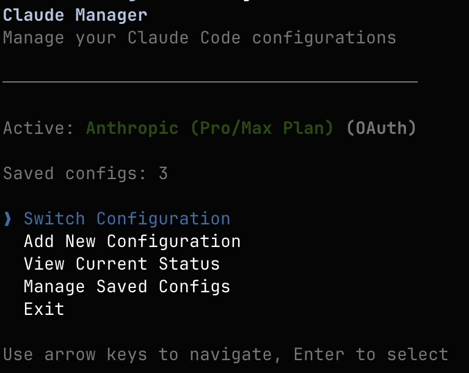

# claude-cfg

CLI tool to easily manage and switch Claude Code configurations across multiple LLM providers.

## Overview



`claude-cfg` helps you quickly configure Claude Code to work with different LLM providers including:

- **Anthropic** (default)
- **OpenRouter** - Access various models through a unified API
- **z.ai** - GLM Coding Plan with 3× usage at lower cost

Instead of manually editing configuration files or environment variables, `claude-cfg` provides an interactive CLI to manage your Claude Code setup.

## Installation

```bash
npm install -g claude-cfg
```

## Usage

Simply run:

```bash
claude-cfg
```

The interactive CLI will guide you through:

1. Selecting your preferred LLM provider
2. Entering required credentials (API keys)
3. Configuring provider-specific settings
4. Automatically updating your Claude Code configuration

## Supported Providers

### Anthropic
The default Claude Code provider. Uses official Anthropic API endpoints.

### OpenRouter
- Access multiple model providers through a single API
- Supports model overrides and presets
- Requires OpenRouter API key from [openrouter.ai](https://openrouter.ai)

### z.ai
- GLM Coding Plan with enhanced usage limits
- Cost-effective alternative to standard Claude pricing
- Requires z.ai API key from [z.ai/model-api](https://z.ai/model-api)

## Configuration

`claude-cfg` automatically manages your Claude Code configuration by updating:
- `~/.claude/settings.json` (recommended)
- Environment variables (alternative method)

All changes are made safely with backups of existing configurations.

## Requirements

- Node.js 18 or newer
- Claude Code installed ([installation guide](https://docs.anthropic.com/en/docs/claude-code/overview))

## Verification

After configuration, verify your setup:

```bash
claude
```

Then inside Claude Code, run:

```text
/status
```

This will show your active API endpoint and authentication method.

## License

MIT

## Author

Akshat Dubey <akshatdubey0808@gmail.com>

## Contributing

Issues and pull requests are welcome on GitHub.
